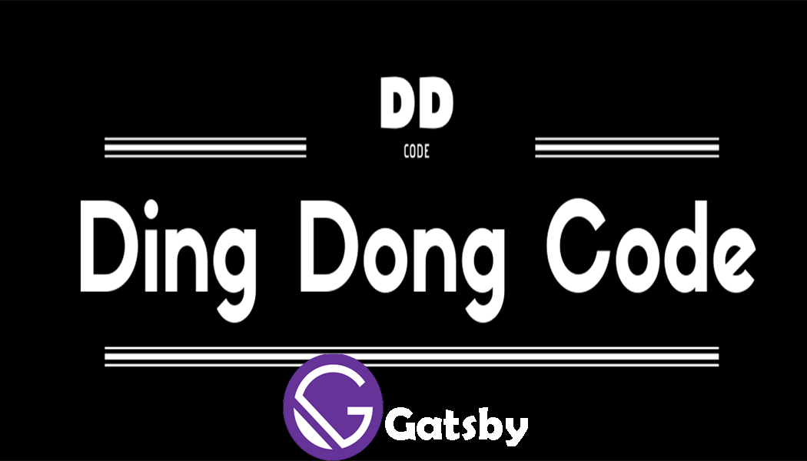

In this is my first post, I want to announce that I have finished building my website and it's called **DING DONG CODE!**
My plan on this website is to share my hobby with you and explain it as best as I can.
what I would like to share is all about my work, especially in creative code

I made this website using Gatsby.
Gatsby is a free and open-source framework based on React. you can see more in [gatsby.org](gatsby.org).
I know this website is full of flaws, so I will improve it in the future because I am not an expert and still in learning.

If you interested and want to make a website with gatsby but don't know how to start, I would suggest you watch this amazing [Great Gatsby Bootcamp](https://www.youtube.com/watch?v=8t0vNu2fCCM) video by Andrew Mead. He has the best explanation and easy to understand and most importantly the course is free so go check and watch that.

That is for my first post, I hope this website can be useful to you 😁.
Thanks for coming!
